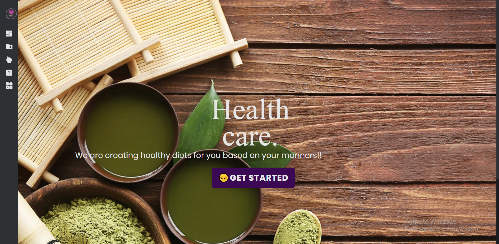
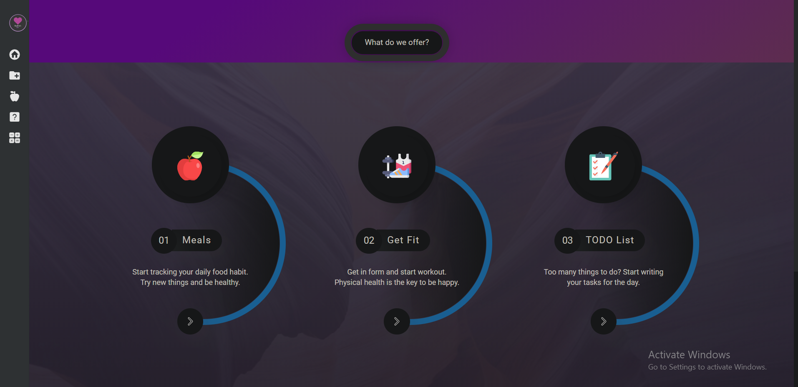
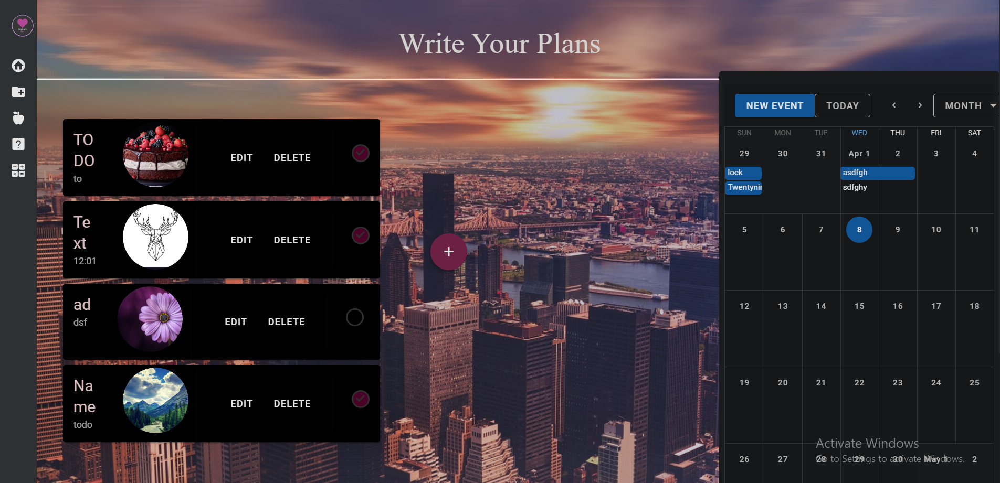
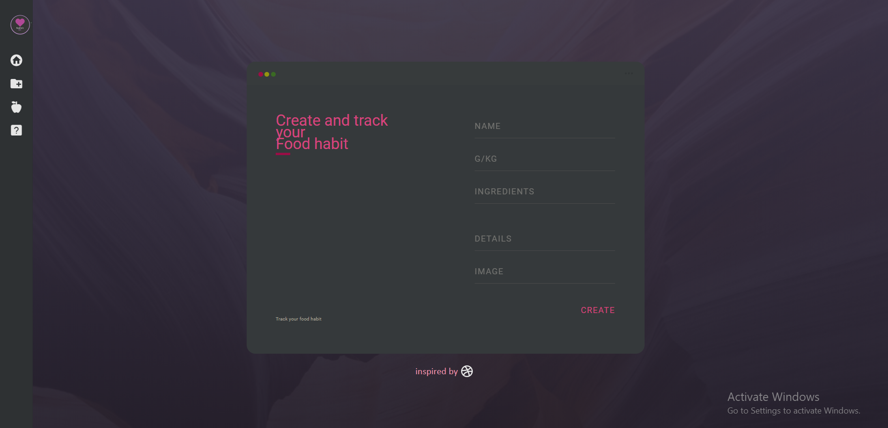
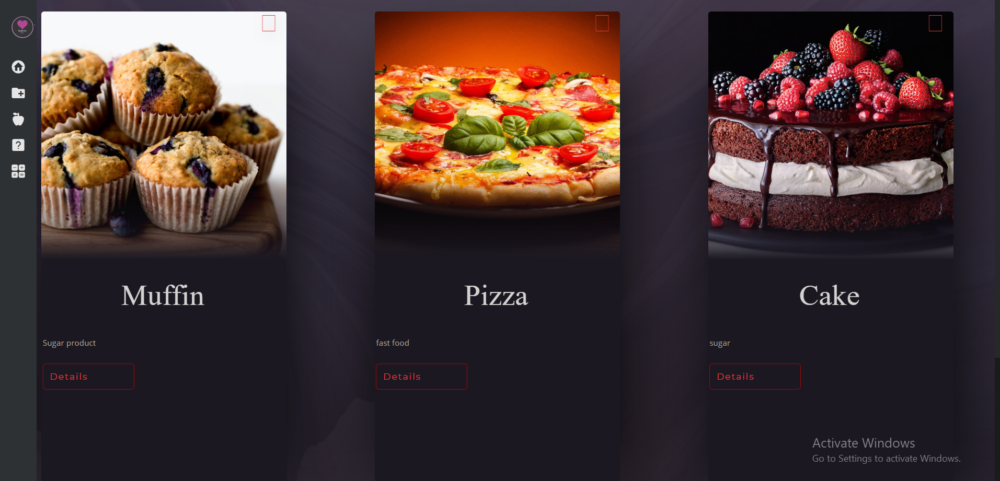
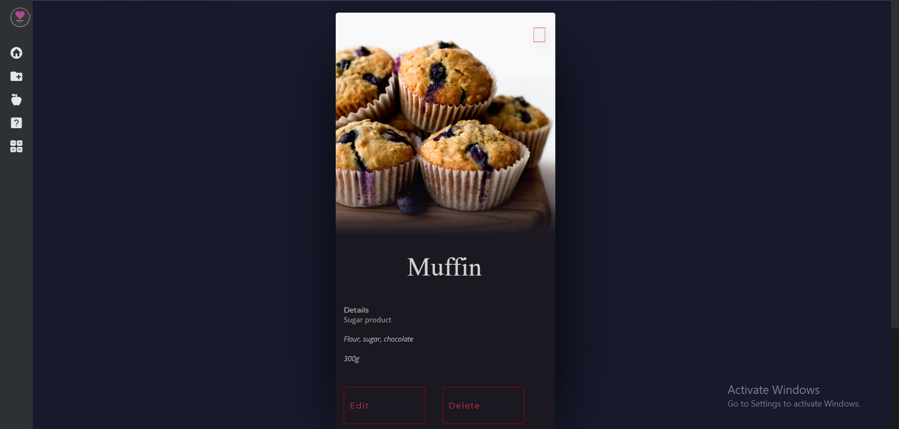
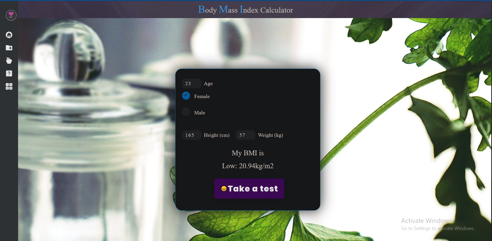
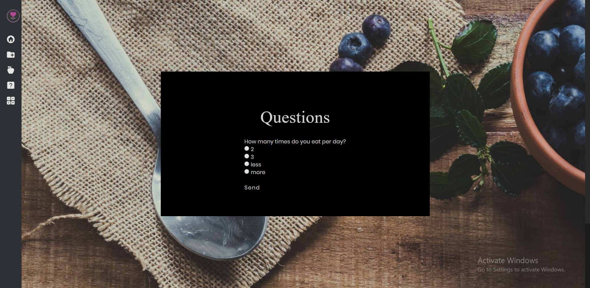

# Deployed app
* https://vue-project-93965.web.app
# Project setup locally
* npm install   
# Compiles
* npm run serve
# Private page

# Get started page

# Task page

# Creating daily food page

# Displaying food page

# Meal details

# BMI 

# Test

# Technologies
* VueJS, Vuex, Axios, Vuetify
# Aim
* The app is abount tracking your daily movements, food habits and todo tasks
